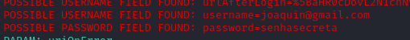

# Phishing para captura de senhas do Facebook

### ⚙️ Ferramentas utilizadas
- Kali Linux
- Setoolkit

### 🔧 Configurando o phishing no kali com o setoolkit
- Logar como root: ``` sudo su ```
- Iniciar o setoolkit: ``` setoolkit ```
- Tipo de ataque: ``` Social-Engineering Attacks ```
- Vetor de ataque: ``` Website Attack Vectors ```
- Método de ataque: ``` Credential Harvester Attack Method ```
- Método de ataque: ``` Site Cloner ```
- Obter o endereço da máquina: ``` ifconfig ```
- ULR so site que sera clona: http://www.facebook.com

### Resultado

